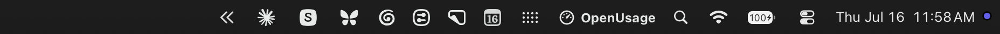

# Menu Bar

Star your most important metrics straight into the menu bar strip.

## Right-clicking the icon

Right-click (or control-click) the menu bar icon for a quick menu with **Settings** and **Quit**. Left-click opens the popover as usual.

## Starring

Star a metric from any row's right-click menu, or from the always-visible star beside a metric in Customize.

- On first launch the app ships with a default set of stars (Antigravity Session/Weekly, Claude Session/Weekly, Codex Session/Weekly, Cursor Auto Usage/API Usage, Copilot Credits, OpenRouter Credits, Z.ai Session/Weekly) so the strip shows numbers right away. Change them anytime; a provider's Reset restores its defaults, and Reset All restores the full set. Only providers that are turned on render in the strip — and a fresh install starts with just the providers detected on your Mac (see [Dashboard § First launch](dashboard.md#first-launch)) — so the default stars don't crowd the menu bar with tools you don't use.
- At most **2 stars per provider**.
- When a star isn't allowed, the star button stays clickable — clicking it shakes and shows the reason in a temporary pill over the bottom of Customize (for example, "Up to 2 stars per provider").

## Styles

Settings → Appearance → Icon Style:

- **Text** — provider icon plus values; two starred metrics from the same provider stack as a labeled pair.
- **Bars** — a compact glyph containing the first four starred metrics that have a limit (metrics without limits only appear in Text style).

## Hiding usage while screen sharing

Settings → Privacy → **Hide From Screen Share** (off by default). While your screen is being shared or recorded — a Zoom/Meet/Teams share, a screen recording, macOS Screen Sharing — the strip is replaced with the OpenUsage icon and wordmark, so token counts and spend never show up in front of an audience. The moment the capture ends, your starred metrics come right back. Captures you start yourself (a screen recording, for example) count too, so those get the wordmark as well.

Detection rides the system's own "an app is capturing the screen" signal — the same one that lights the capture indicator in the menu bar — checked the instant it changes and re-checked every few seconds while the setting is on.

Normally:

While the screen is shared or recorded:

## What the strip shows

The strip only renders real data. A starred metric with nothing fetched yet is skipped; a provider whose stars all lack data disappears entirely (icon included). When nothing has data, the strip falls back to the app icon. Stars follow your Customize order — Always Visible metrics first, then On Demand ones. A metric can be starred whether it's Always Visible or On Demand.
