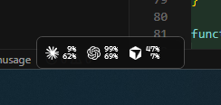
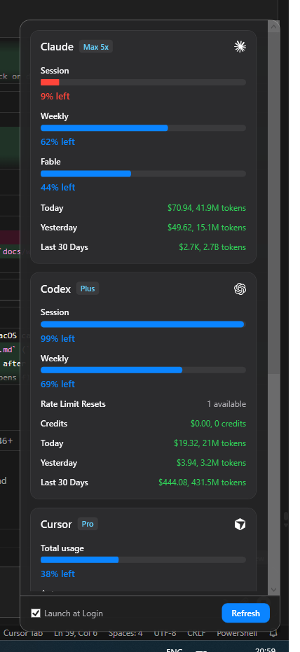

# OpenUsage on Windows (experimental)

OpenUsage for Windows is an **experimental research spike**, not a shipped product. The macOS menu-bar app in `Sources/OpenUsage/` is unchanged; Windows work lives under `spikes/windows-core/` (Swift sidecar) and `spikes/windows-shell/` (WPF tray + floating strip + flyout).

## Screenshots

Floating strip (always-on-top; click or double-click opens the flyout):



Flyout (tray or strip → provider cards with `% left`, spend, Refresh):



## Status

| Area | Spike state |
|---|---|
| Core providers | Claude, Codex, Cursor, Grok, OpenRouter, Z.ai in `spikes/windows-core/` |
| UI | Tray logo + **floating always-on-top strip** + dark flyout with progress bars |
| Refresh | Manual + **every 5 minutes** (macOS cadence) |
| System | Single instance, launch at login toggle, toasts, logging, sidecar supervision |
| Packaging | Unsigned self-contained zip (~85 MB) via `script/package_windows.ps1` |
| Updates | Check-only stub; no in-app installer yet |
| Production merge | Not started — see [Windows port plan](research/windows-port-plan.md) and [PR readiness](research/windows-pr-readiness.md) |

## Install (unsigned zip)

1. Build or obtain `dist/windows/OpenUsage-windows-x64.zip` (see **Build from source** below).
2. Extract the zip to a folder you control (e.g. `%LOCALAPPDATA%\Programs\OpenUsage`).
3. Run `OpenUsageShell.exe`. Keep `sidecar.exe` and the bundled Swift/.NET DLLs in the same folder.

**SmartScreen:** The spike is **not Authenticode-signed**. Windows Defender SmartScreen will warn about an unknown publisher on first run. That is expected until an OV/EV or Azure Trusted Signing certificate is procured (see [Phase 5 findings](research/windows-phase5-findings.md)).

**Launch at login:** Off by default. Enable only from the tray or flyout if you want it; the spike writes `HKCU\...\Run\OpenUsage`.

## How credentials are discovered

OpenUsage reads credentials already on your PC — same idea as macOS, with Windows paths. Paths only; no secrets are logged.

| Provider | Where the spike looks |
|---|---|
| **Claude** | `%USERPROFILE%\.claude\.credentials.json` (`claudeAiOauth` keys). Credential Manager `Claude Code-credentials` when present (not on all installs). |
| **Codex** | `%USERPROFILE%\.codex\auth.json` (respects `CODEX_HOME` if set). |
| **Cursor** | `%APPDATA%\Cursor\User\globalStorage\state.vscdb` (SQLite; live read-only open while Cursor runs). **Note:** Swift `FileManager.applicationSupport` does not match this path — the spike uses `%APPDATA%` explicitly. |
| **Grok** | `%USERPROFILE%\.grok\auth.json` and `%USERPROFILE%\.grok\logs\unified.jsonl`. |
| **OpenRouter** | Env `OPENROUTER_API_KEY`, or `%USERPROFILE%\.config\openusage\openrouter.json`, or `%USERPROFILE%\.config\openrouter\key.json`. |
| **Z.ai** | Env `ZAI_API_KEY` / `Z_AI_API_KEY`, or `%USERPROFILE%\.config\openusage\zai.json`. |
| **Copilot** (not in spike UI yet) | `%APPDATA%\GitHub CLI\hosts.yml`; Credential Manager `gh:github.com:<user>`. |
| **Antigravity** (not in spike UI yet) | Credential Manager `gemini:antigravity`. |
| **Devin** (not in spike) | `%APPDATA%\Devin\...\state.vscdb` or `%USERPROFILE%\.local\share\devin\credentials.toml` when Devin is installed. |

Third-party stores are **read-only** in the spike (no write-back to Cursor DB or Credential Manager). Details: [Phase 2 findings](research/windows-phase2-findings.md).

## Differences vs macOS

| macOS | Windows spike |
|---|---|
| Menu bar (`NSStatusItem`) + popover | System tray + **floating strip** (drag; position saved) + borderless flyout |
| Pin metrics in the menu bar | Floating strip shows default-style pins (session/weekly/auto/api as available); full Customize pins TBD |
| Sparkle signed updates | Update-check stub only; download link, no auto-install |
| Full dashboard, settings, customize | Provider cards, refresh, launch-at-login; no Customize/Settings screens yet |
| Local HTTP API `127.0.0.1:6736` | **Not implemented** on Windows yet |
| Global shortcut | **Not implemented** |
| All 9 providers in production app | 6 in core spike; Copilot/Devin/Antigravity not wired in shell |
| Notarized DMG | Unsigned zip |
| Reset countdowns on meters | **Not on the wire yet** (`resetsAt` deferred) |

## Build from source

**Requirements:** Windows 10/11 x64, Swift 6.3.3 (MSVC), VS 2022 Build Tools + Windows SDK, .NET 8 SDK. Full setup: [windows-toolchain.md](research/windows-toolchain.md).

**Dev loop** (build + launch debug shell):

```powershell
.\script\build_and_run.ps1          # build and run
.\script\build_and_run.ps1 verify   # build, run, fail if process missing
```

**Core tests only:**

```powershell
$env:SDKROOT = [Environment]::GetEnvironmentVariable("SDKROOT","User")
cd spikes\windows-core
cmd /s /c "`"C:\Program Files (x86)\Microsoft Visual Studio\2022\BuildTools\VC\Auxiliary\Build\vcvars64.bat`" && swift test"
```

**Packaged zip:**

```powershell
.\script\package_windows.ps1
# -> dist\windows\OpenUsage-windows-x64.zip
```

Logs: `%LOCALAPPDATA%\OpenUsage\logs\shell.log` (WPF) and `OpenUsage.log` (sidecar).

## Known limitations (spike)

- Cold start often **~30–70 s** while the sidecar bootstraps live provider refreshes.
- Refresh cadence is fixed at **5 minutes** (plus manual Refresh); no settings UI.
- No auto-update install path; no Authenticode signing (SmartScreen warning).
- Flyout is a simplified dashboard — not Customize / Settings / share cards.
- Explored-and-removed experiments (Windows Widgets Board / taskbar pill) are documented in phase notes; they are **not** in the tree.

## Opening a research PR

See **[windows-pr-readiness.md](research/windows-pr-readiness.md)** for cleanup consensus, product-beta blockers, and a PR body template. Upstream is typically [robinebers/openusage](https://github.com/robinebers/openusage); this fork can open a PR against `main` once the checklist there is green.

Research docs: [windows-port-plan.md](research/windows-port-plan.md), phase findings under [docs/research/](research/), and the [manual test checklist](research/windows-manual-test-checklist.md).
